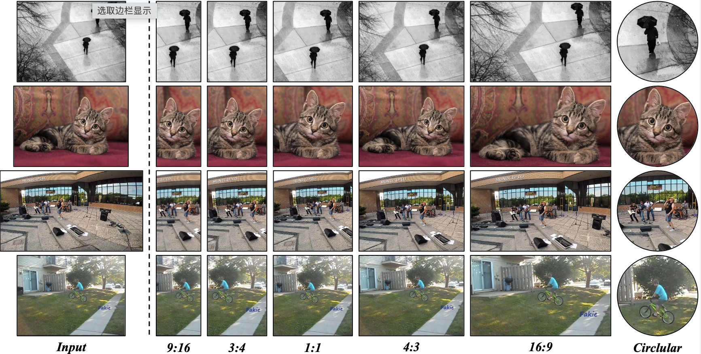

# Spatial-Semantic Collaborative Cropping for User Generated Content

A large amount of User Generated Content (UGC) is uploaded to the Internet daily and displayed to people world-widely through the client side (eg., mobile and PC). This requires the cropping algorithms to produce the aesthetic thumbnail within a specific aspect ratio on different devices. However, existing image cropping works mainly focus on landmark or landscape images, which fail to model the relations among the multi-objects with the complex background in UGC. Besides, previous methods merely consider the aesthetics of the cropped images while ignoring the content integrity, which is crucial for UGC cropping. In this paper, we propose a Spatial-Semantic Collaborative cropping network (S2CNet) for arbitrary user generated content accompanied by a new cropping benchmark. Specifically, we first mine the visual genes of the potential objects. Then, the suggested adaptive attention graph recasts this task as a procedure of information association over visual nodes. The underlying spatial and semantic relations are ultimately centralized to the crop candidate through differentiable message passing, which helps our network efficiently to preserve both the aesthetics and the content integrity. Extensive experiments on the proposed UGCrop5K and other public datasets demonstrate the superiority of our approach over state-of-the-art counterparts.




## Usage

### Requirement

```
torch >= 1.1.0
torchvision >= 0.7.0
python3
```

### Installation

Build and install source code of roi_align_api and rod_align_api.

```
bash make_all.sh
```

### Preparation

1. Download the dataset ([GAICv1](https://github.com/HuiZeng/Grid-Anchor-based-Image-Cropping-Pytorch) and [GAICv2](https://github.com/HuiZeng/Grid-Anchor-based-Image-Cropping-Pytorch))

   ```
   dataset
    --GAIC
          --annotations
          --bbox
          --images
    --GAIC-journal
          --annotations
          --bbox
          --images
   ```

2. Download the pre-trained weight ([GAICv1](https://drive.google.com/file/d/1FqUBO9MZNyaePDjyd6TEGz2AIKeNf1MU/view?usp=sharing) and [GAICv2](https://drive.google.com/file/d/1xtvNU0G7243ZKW29QR8Fpv4mFJn6a7TF/view?usp=sharing))

### Inference

```
python test.py --cfg {path_to_config} --pretrained {path_to_pretrained_weight}
```

## Citation

If you find the code useful, please consider citing our paper using the following BibTeX entry.

```latex
@article{su2024spatial,
  title={Spatial-Semantic Collaborative Cropping for User Generated Content},
  author={Su, Yukun and Cao, Yiwen and Deng, Jingliang and Rao, Fengyun and Wu, Qingyao},
  journal={arXiv e-prints},
  pages={arXiv--2401},
  year={2024}
}
```

## Acknowledge

Our project references the codes in the following repos.

- [GAIC](https://github.com/lld533/Grid-Anchor-based-Image-Cropping-Pytorch)
- [Faster-RCNN](https://github.com/shilrley6/Faster-R-CNN-with-model-pretrained-on-Visual-Genome)